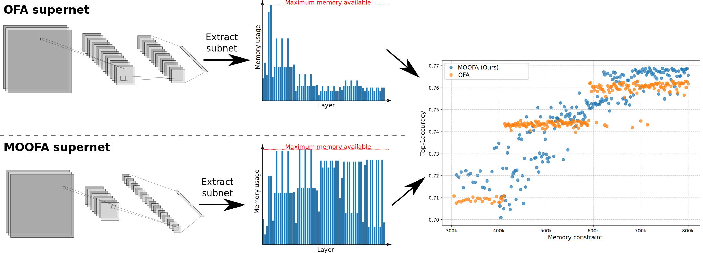

# MOOFA | Memory-Optimized Once-For-All Network

This repository contains the implementation of a memory-optimized Once-For-All (OFA) supernet, which improves DNN deployment efficiency on resource-constrained devices by providing image classification models efficient under tight memory budget.

This works is based on the original OFA supernet developed by MIT's HAN Lab. The code is adapted from the [Once-For-All repository](https://github.com/mit-han-lab/once-for-all)


*We propose a revised architecture of the OFA supernet that aims to provide memory-optimized subnets, thereby allowing for improved accuracy under tight memory constraints.*

## Abstract

Deploying Deep Neural Networks (DNNs) on different hardware platforms is challenging due to varying resource constraints. Besides handcrafted approaches aiming at making deep models hardware-friendly, Neural Architectures Search is rising as a toolbox to craft more efficient DNNs without sacrificing performance. Among these, the Once-For-All (OFA) approach offers a solution by allowing the sampling of well-performing sub-networks from a single supernet- this leads to evident advantages in terms of computation. However, OFA does not fully utilize the potential memory capacity of the target device, focusing instead on limiting maximum memory usage per layer. This leaves room for an unexploited potential in terms of model generalizability.

In this paper, we introduce a Memory-Optimized Once-For-All (MOOFA) supernet, designed to enhance DNN deployment on resource-limited devices by maximizing memory usage (and for instance, features diversity) across different configurations. Tested on ImageNet, our MOOFA supernet demonstrates improvements in memory exploitation and model accuracy compared to the original OFA supernet.

## Key Features

- Memory-optimized OFA supernet implementation
- Improved accuracy without compromising memory space requirements
- Optimal performance under stringent memory constraints

## Results

### Accuracy Comparison


*Figure 1: Top-1 Accuracy achieved vs max number of parameters constraint for both OFA nets.*


*Figure 2: Top-1 Accuracy achieved vs max number of parameters constraint for both OFA nets, focused on tighter constraints.*

### Performance Results

| Constraint | Metric         | MIT OFA | CompOFA | MOOFA  |
| ---------- | -------------- | ------- | ------- | ------- |
| Under 325k | Top-1 Accuracy | 70.81   | 69.91   | 72.13   |
|            | Memory peak    | 262,912 | 262,912 | 305,280 |
|            | FLOPs          | 146     | 132     | 422     |
| Under 350k | Top-1 Accuracy | 70.91   | 70.26   | 72.25   |
|            | Memory peak    | 328,704 | 330,816 | 313,344 |
|            | FLOPs          | 163     | 134     | 431     |
| Under 400k | Top-1 Accuracy | 70.98   | 70.23   | 73.34   |
|            | Memory peak    | 330,816 | 329,280 | 381,120 |
|            | FLOPs          | 163     | 144     | 554     |
| Under 450k | Top-1 Accuracy | 74.33   | 73.33   | 73.66   |
|            | Memory peak    | 410,368 | 410,368 | 440,640 |
|            | FLOPs          | 219     | 178     | 573     |
| Under 500k | Top-1 Accuracy | 74.24   | 72.76   | 72.99   |
|            | Memory peak    | 410,368 | 410,368 | 475,776 |
|            | FLOPs          | 207     | 189     | 516     |
| Under 600k | Top-1 Accuracy | 76.02   | 73.82   | 74.99   |
|            | Memory peak    | 590,592 | 590,592 | 583,200 |
|            | FLOPs          | 271     | 258     | 719     |
| Under 700k | Top-1 Accuracy | 75.83   | 75.42   | 76.55   |
|            | Memory peak    | 590,592 | 590,592 | 696,192 |
|            | FLOPs          | 289     | 273     | 1,007   |
| Under 800k | Top-1 Accuracy | 76.04   | 74.78   | 76.58   |
|            | Memory peak    | 740,416 | 722,448 | 686,976 |
|            | FLOPs          | 283     | 306     | 959     |

*Table 1: Results for MIT OFA supernet and our memory-constant OFA supernet.*

## Usage

### Training Script

The script `train.py` provides a way to train the MOOFA supernet. It supports training the teacher model, and progressive shrinking for kernel, depth, and expansion ratio. The number of phases and hyperparameters for each step are defined in the configuration file.
To train the MOOFA network, use the following command:

```bash
horovod -np <num_of_gpus> python train.py --config <config_file> --step <step> --phase <phase> [--model_config_path <model_config_path>]
```

#### Parameters:

- `--config <config_file>`: (Required) Path to the YAML configuration file containing training settings.
  - Example: `--config configs/config_MOOFA.yaml`
  - This file includes various training parameters, model architecture settings, and task-specific configurations.

- `--step <step>`: (Required) Specifies the current training step. Choose one of:
  - `teacher`: For training the teacher model
  - `kernel`: For kernel size search
  - `depth`: For depth search
  - `expand`: For expansion ratio search

- `--phase <phase>`: (Required for progressive shrinking steps) Specifies the phase number within the current step.
  - Example: `--phase 1`
  - The number of phases for each step is defined in the configuration file.

- `--model_config_path <model_config_path>`: (Optional) Path to the model configuration file.
  - Default: `model_configs.yaml`
  - This file contains specific architectural details for different model variants.

#### Example Usage:

Train the teacher model:
```bash
horovod -np 8 python train.py --config configs/config_MOOFA.yaml --step teacher
```

Train the MOOFA supernet using progressive shrinking on kernel step:
```bash
horovod -np 8 python train.py --config configs/config_MOOFA.yaml --step kernel --phase 1
```

Continue with depth step (phase 1 and 2):
```bash
horovod -np 8 python train.py --config configs/config_MOOFA.yaml --step depth --phase 1
horovod -np 8 python train.py --config configs/config_MOOFA.yaml --step depth --phase 2
```

Complete the MOOFA net training with expand step (phase 1 and 2):
```bash
horovod -np 8 python train.py --config configs/config_MOOFA.yaml --step expand --phase 1
horovod -np 8 python train.py --config configs/config_MOOFA.yaml --step expand --phase 2
```

Remember to adjust the number of processes (`-np`) based on your available GPU resources and to ensure your configuration files are set up correctly before starting the training process.

### Evaluation and Search Script

The `eval_and_search.py` script provides functionality for evaluating trained models and performing architecture search. It supports two main modes: evaluation and search.

To use the script, run the following command:

```bash
horovod -np <num_of_gpus> python eval_and_search.py --config <config_file> --mode <mode> [--model <model>] [--model_config_path <model_config_path>]
```

#### Parameters:

- `--config <config_file>`: (Required) Path to the YAML configuration file containing evaluation or search settings.
  - Example: `--config configs/config_MOOFA.yaml`

- `--mode <mode>`: (Required) Specifies the operation mode. Choose one of:
  - `eval`: For evaluating a trained model
  - `search`: For performing architecture search

- `--model <model>`: (Required and has effect for eval mode only) Specifies which model to evaluate:
  - `supernet`: Evaluate the trained supernet
  - `teacher`: Evaluate the teacher model

- `--model_config_path <model_config_path>`: (Optional) Path to the model configuration file.
  - Default: `model_configs.yaml`

#### Evaluation Mode

In evaluation mode, the script can assess the performance of either the supernet or the teacher model. It calculates accuracy, forward pass time, flops, and can optionally generate subnet graphs and memory usage histograms (set in the config file).

Example usage for evaluating the teacher model:

```bash
horovod -np 8 python eval_and_search.py --config configs/config_MOOFA.yaml --mode eval --model teacher
```

Example usage for evaluating the supernet:

```bash
horovod -np 8 python eval_and_search.py --config configs/config_MOOFA.yaml --mode eval --model supernet
```

#### Search Mode

In search mode, the script performs architecture search using evolutionary algorithms to find optimal subnet configurations under given constraints. It uses accuracy and efficiency predictors to guide the search process.

Example usage for architecture search:

```bash
horovod -np 8 python eval_and_search.py --config configs/search_config.yaml --mode search
```

The search process will generate subnet configurations, evaluate them, and save the results, including accuracy predictions, real accuracy measurements, peak memory usage, FLOPs, and average forward pass time.

Remember to adjust the number of processes (`-np`) based on your available GPU resources and to ensure your configuration files are set up correctly before running the evaluation or search process.

### Dataset Creation Script

The script `create_moofa_predictor_dataset`.py generates a balanced dataset for training the MOOFA accuracy predictor by sampling subnet configurations from the MOOFA supernet and evaluating their performance. Ensuring balance is crucial because random sampling would over-represent high-memory configurations, leading to poor accuracy predictions for low-memory configurations. This balance is key to training an effective accuracy predictor for memory-constrained environments.

To create the MOOFA predictor dataset, use the following command:

```bash
horovod -np <num_of_gpus> python create_moofa_predictor_dataset.py --config <config_file> [--model_config_path <model_config_path>]
```

#### Parameters:

- `--config <config_file>`: (Required) Path to the YAML configuration file containing dataset creation settings.
  - Example: `--config configs/config_MOOFA.yaml`

- `--model_config_path <model_config_path>`: (Optional) Path to the model configuration file.

#### Example Usage:

```bash
horovod -np 8 python create_moofa_predictor_dataset.py --config configs/config_MOOFA.yaml
```

Depending on the number of GPUs chosen, multiple dataset will be created in parallel. They may be merged using a simple python script like the following :

```python
all_configs = []
all_accuracies = []
all_features = []
all_efficiencies = []
for i in range(num_gpus):
    with open(os.path.join(search_config['acc_dataset_path'], f"gpu{i}.pkl"), "rb") as f:
        data = pickle.load(f)
        all_configs.extend(data["configs"])
        all_accuracies.extend(data["accuracies"])
        all_features.extend(data["features"])
        all_efficiencies.extend(data["efficiencies"])

dataset = {
    "configs": all_configs,
    "accuracies": all_accuracies,
    "features": all_features,
    "efficiencies": all_efficiencies
}

with open(os.path.join(search_config['acc_dataset_path'], "dataset.pkl"), "wb") as f:
    pickle.dump(dataset, f)

print(f"Balanced dataset saved to {search_config['acc_dataset_path']}/dataset.pkl")
```

### Predictor Training Script

The `train_moofa_predictor.py` script is responsible for training the accuracy predictor. The training is done from the dataset collected with the `create_moofa_predictor_dataset.py` script. 

#### Usage

```bash
python train_moofa_predictor.py --config <config_file> [--output <output_file>] [--model_config_path <model_config_path>]
```

#### Parameters:

- `--config <config_file>`: (Required) Path to the YAML configuration file containing dataset creation settings.
  - Example: `--config configs/config_MOOFA.yaml`

- `--output <output_file>`: (Optional) Path to the output file where a summary image will be saved.

- `--model_config_path <model_config_path>`: (Optional) Path to the model configuration file.
  - Default: `model_configs.yaml`

#### Example Usage:
  
  ```bash
  python train_moofa_predictor.py --config configs/config_MOOFA.yaml --output moofa_predictor.png
  ```

## Configuration

Modify one of the provided config file in `configs/` to adjust training parameters and other settings.

### Configuration File Structure

The configuration file is structured as follows:

#### General Settings

The path to the model directory must be precised here. This path is used for saving and loading models during supernet training.

```yaml
  path: "models/MOOFA/"
```

The path to the teacher model must be precised here. This path is used for saving the teacher model during teacher training, and loading it for teacher model evaluation. It is also used to load the teacher model during supernet training.

```yaml
  teacher_path: "models/MOOFA/teacher/"
```

The checkpoint path is used to save and load the supernet during evaluation and search.

```yaml
  checkpoint: "models/MOOFA/checkpoint/checkpoint-expand_2.pth.tar"
```

The model architecture is defined here. Options are: "OFA", "CompOFA", "MOOFA_V1", "MOOFA_V2", "MOOFA_V3". They correspond to the different supernet architectures available for eval/searching and training (trianing is not available for CompOFA). Some architectures may be modified in the `model_configs.yaml` file, although we recommand to use the preset values.

```yaml
  model: "MOOFA_V3"
```

The dataset used for training and evaluation is defined here. Options are: "imagenette", "imagenet".

```yaml
  dataset: "imagenet"
```

Other general settings are available, mostly training hyperparameters, such as the batch size, the weight decay, etc.

#### Training Steps Settings

The training steps are defined here. The number of phases for each step is defined in the `tasks_phases` section. Warning : the number of phase for each task may be modified here, but according modifications must be made in the `args_per_task` section AND in the `model_configs.yaml` file. The number of phase must always be striclty lower than the number of available parameters for a given task.

```yaml
tasks: ["kernel", "depth", "expand"]
tasks_phases:
  kernel: 1
  depth: 2
  expand: 2
```

The number of epochs, the learning rate, and other hyperparameters for each task/phase (including teacher training) is defined here.

```yaml
args_per_task:
  teacher:
    n_epochs: 180
    base_lr: 3.0e-2
    warmup_epochs: 0 
    warmup_lr: 3.0e-3
    dynamic_batch_size: 1
  kernel_1:
    ...
  depth_1:
    ...
  ...
```

##### Evaluation Settings

The evaluation settings are defined in the `subnet_config` section.

The `random_sample` parameter allows to randomly sample subnets from the supernet for evaluation. If set to `false`, the subnets are sampled according to the subnet configuration defined in the `subnet_config` section.

```yaml
random_sample: false
```

If `random_sample` is set to `false`, the subnet configuration is defined here. The `ks`, `e`, and `d` parameters define the kernel size, expansion ratio, and depth of the subnets, respectively. The `image_size` parameter defines the input image size.

```yaml
ks: [7, 7, 7, 7, 7, 7, 7, 7, 7, 7, 7, 7, 7, 7, 7, 7, 7, 7, 7, 7]
e: [4, 4, 4, 4, 4, 4, 4, 4, 4, 4, 4, 4, 4, 4, 4, 4, 4, 4, 4, 4]
d: [4, 4, 4, 4, 4]
image_size: 224
```

The `res_dir` parameter defines the directory where the evaluation results are saved.

```yaml
res_dir: "results/MOOFA/"
```

The `name` parameter defines the name of the evaluation results dir, that will contain a file `info.json` with the result of the evaluation, and the graphs if `draw_graphs` is set to `true`.

```yaml
name: "reference_subnet"
```

If `draw_graphs` is set to `true`, the script will generate the subnet graph and a the memory histogram for the subnet evaluated.

```yaml
draw_graphs: true
```

#### Search Settings

The search settings are defined in the `search_config` section.

The `N_constraint` parameter defines the number of constraints for the search. The constraints are linearly distributed on the interval `[min_constraint, max_constraint]`.

```yaml
  N_constraint: 20
  max_constraint: 300000
  min_constraint: 800000
```

The results of the search are saved in the `res_dir` directory.

```yaml
  res_dir: "searches/MOOFA/"
```

The accuracy predictor dataset is defined in the `acc_dataset_path` parameter. This path is both used by the `create_moofa_predictor_dataset.py` script to store the dataset created and the `train_moofa_predictor.py` script to load the dataset for training the accuracy predictor. Warning : the dataset must be stored in one pickle file. If created using horovod and multiple GPUs, the dataset must be merged before training the predictor. See the `create_moofa_predictor_dataset.py` script documentation for more information.

```yaml
  acc_dataset_path: "acc_predictor_datasets/adapted/MOOFA/dataset.pkl"
```

The accuracy predictor checkpoint is defined in the `acc_predictor_checkpoint` parameter. This checkpoint path is used both by the `train_moofa_predictor.py` script to save the trained accuracy predictor and by the `eval_and_search.py` script to load the predictor for architecture search.

```yaml
  acc_predictor_checkpoint: "acc_predictor_checkpoints/MOOFA_acc.pth.tar"
```

#### Logging Settings

The MOOFA source code includes logging via wandb. The `wandb` section of the configuration file allows to define the wandb project name.

To use wandb, set `use_wandb` to `true` and define the `project_name` parameter.

```yaml
wandb:
  use_wandb: true
  project_name: "memory-optimized-once-for-all"  
```

An api key must be set using wandb login before running the training scripts. It may be done using :

```bash
wandb login
```

More information on wandb may be found [here](https://docs.wandb.ai/quickstart)

## Dependencies and Installation

The source code has been developped and tested with Python 3.11.9, CUDA 12.1, PyTorch 2.3.1 and Horovod 0.28.1. The full list of dependencies is available in the `environment.yml` file.

It can be installed using conda :

```bash
conda env create -f environment.yml
```

## Pretrained Models

Pretrained models are available for download [here](https://drive.google.com/file/d/1xSFRTZ9b9ONI7_8s_VEyKLzd5rLihYAT)

The pretrained models include the teacher model and checkpoints for the MOOFA supernet after each training step.

Pretrained models for OFA and CompOFA are also available from the respective original work repositories:

- [OFA](https://github.com/han-cai/files/tree/master/ofa/ofa_checkpoints)
- [CompOFA](https://github.com/gatech-sysml/CompOFA/tree/main/ofa/checkpoints)

## Contributing

We welcome contributions to improve the MOOFA supernet. Please feel free to submit issues and pull requests.

<!-- ## Citation

If you use this code in your research, please cite our paper:

```bibtex
@article{your-paper,
  title={Memory-Optimized Once-For-All Network},
  author={Your Name},
  journal={arXiv preprint arXiv:XXXX.XXXXX},
  year={2024}
}
``` -->

## License

This project is licensed under the MIT License