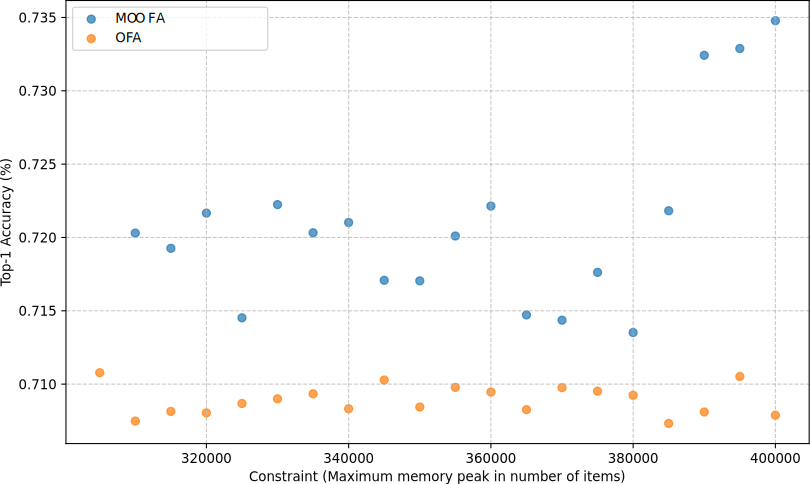

# Memory-Constant Once-For-All Network

This repository contains the implementation of a memory-constant Once-For-All (OFA) supernet, which improves DNN deployment efficiency on resource-constrained devices by providing image classification models efficient under tight memory budget.

This works is based on the original OFA supernet developed by MIT's HAN Lab. The code is adapted from the [Once-For-All repository](https://github.com/mit-han-lab/once-for-all)


*We propose a revised architecture of the OFA supernet that aims to provide memory-optimized subnets, thereby allowing for improved accuracy under tight memory constraints.*

## Abstract

Deep neural networks (DNNs) are challenging to deploy on various hardware platforms due to differing resource constraints. The Once-For-All (OFA) network, developed by MIT's HAN Lab, enables the selection of sub-networks designed for particular hardware constraints. This project presents a memory-constant OFA supernet that improves DNN deployment efficiency on resource-constrained devices by maintaining constant memory usage across configurations.

Our memory-constant supernet exhibits notable improvements in accuracy without sacrificing memory space requirement when compared to the original MIT OFA supernet. According to our work, the proposed supernet can create subnets that operate with better even when faced with severe memory limitations, providing a workable solution for DNN deployment on microcontrollers.

## Key Features

- Memory-constant OFA supernet implementation
- Improved accuracy without compromising memory space requirements
- Optimal performance under stringent memory constraints

## Results

### Accuracy Comparison


*Figure 1: Top-1 Accuracy achieved vs max number of parameters constraint for both OFA nets.*


*Figure 2: Top-1 Accuracy achieved vs max number of parameters constraint for both OFA nets, focused on tighter constraints.*

### Performance Results

| Constraint | Metric | MIT OFA | CompOFA | MC OFA |
|------------|--------|---------|---------|--------|
| Under 325k | Top-1 Accuracy | 70.81 | 69.91 | 72.13 |
|            | Memory peak | 262,912 | 262,912 | 305,280 |
|            | FLOPs | 146 | 132 | 422 |
| Under 350k | Top-1 Accuracy | 70.91 | 70.26 | 72.25 |
|            | Memory peak | 328,704 | 330,816 | 313,344 |
|            | FLOPs | 163 | 134 | 431 |
| Under 400k | Top-1 Accuracy | 73.34 | 70.23 | 73.34 |
|            | Memory peak | 330,816 | 329,280 | 381,120 |
|            | FLOPs | 163 | 144 | 554 |
| Under 450k | Top-1 Accuracy | 74.33 | 73.33 | 73.66 |
|            | Memory peak | 410,368 | 410,368 | 440,640 |
|            | FLOPs | 219 | 178 | 573 |
| Under 500k | Top-1 Accuracy | 74.24 | 72.76 | 72.99 |
|            | Memory peak | 410,368 | 410,368 | 475,776 |
|            | FLOPs | 207 | 189 | 516 |
| Under 600k | Top-1 Accuracy | 76.02 | 73.82 | 74.99 |
|            | Memory peak | 590,592 | 590,592 | 583,200 |
|            | FLOPs | 271 | 258 | 719 |
| Under 700k | Top-1 Accuracy | 75.83 | 75.42 | 76.55 |
|            | Memory peak | 590,592 | 590,592 | 696,192 |
|            | FLOPs | 289 | 273 | 1,007 |
| Under 800k | Top-1 Accuracy | 76.04 | 74.78 | 76.58 |
|            | Memory peak | 740,416 | 722,448 | 686,976 |
|            | FLOPs | 283 | 306 | 959 |

*Table 1: Results for MIT OFA supernet and our memory-constant OFA supernet.*

## Usage

### Training the Teacher Model

```bash
horovodrun -np 8 train_teacher.py --config config.yaml
```

### Training the Supernet

```bash
horovodrun -np 8 train_supernet.py --config config.yaml --step kernel --phase 1
```

### Evaluating the Supernet

```bash
python eval_supernet --config config.yaml
```

### Searching the Supernet

```bash
python search_supernet --config config.yaml
```

## Requirements

- PyTorch 2.3.1
- Horovod 0.28.1


## Configuration

Modify the `config.yaml` file to adjust training parameters, model architecture, and other settings.

## Contributing

We welcome contributions to improve the memory-constant OFA supernet. Please feel free to submit issues and pull requests.

<!-- ## Citation

If you use this code in your research, please cite our paper:

```bibtex
@article{your-paper,
  title={Memory-Constant Once-For-All Network for Efficient DNN Deployment},
  author={Your Name},
  journal={arXiv preprint arXiv:XXXX.XXXXX},
  year={2024}
}
``` -->

## License

This project is licensed under the MIT License